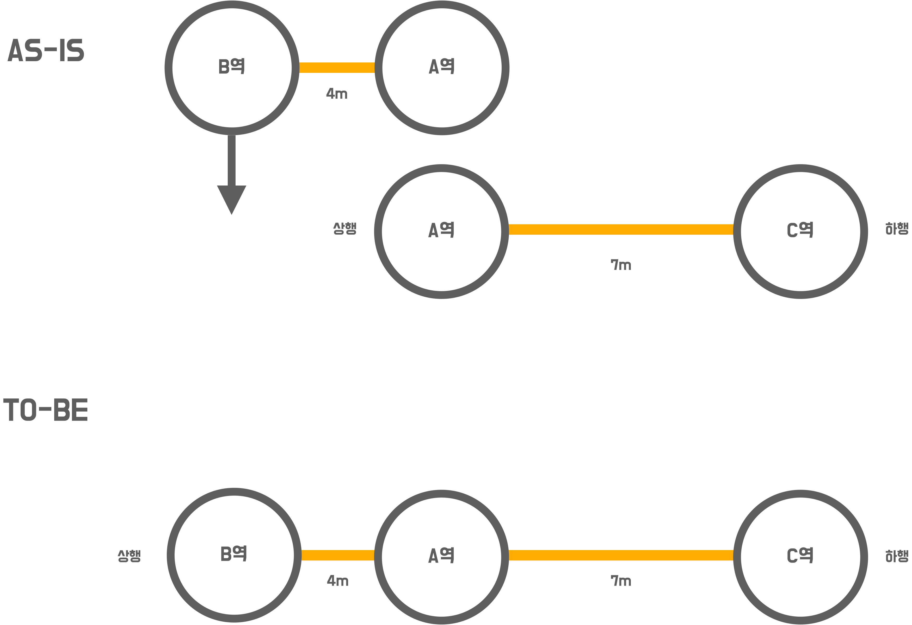
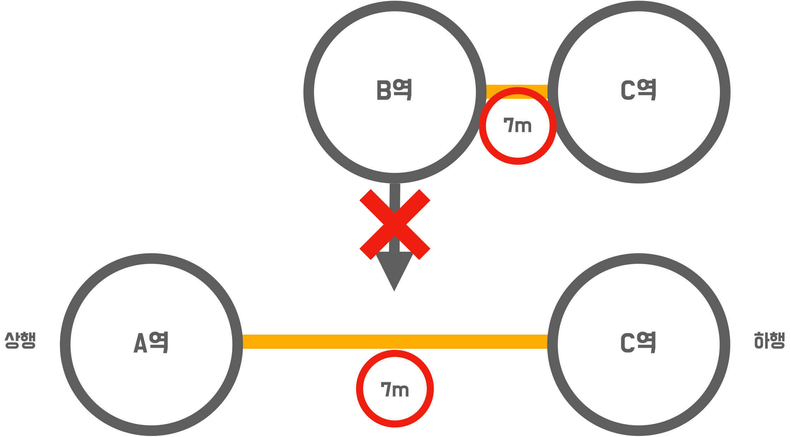
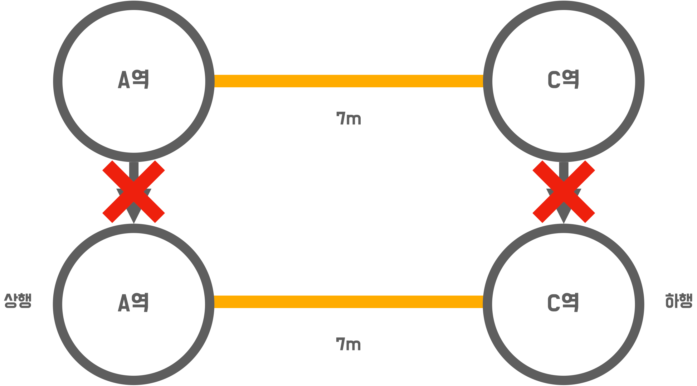
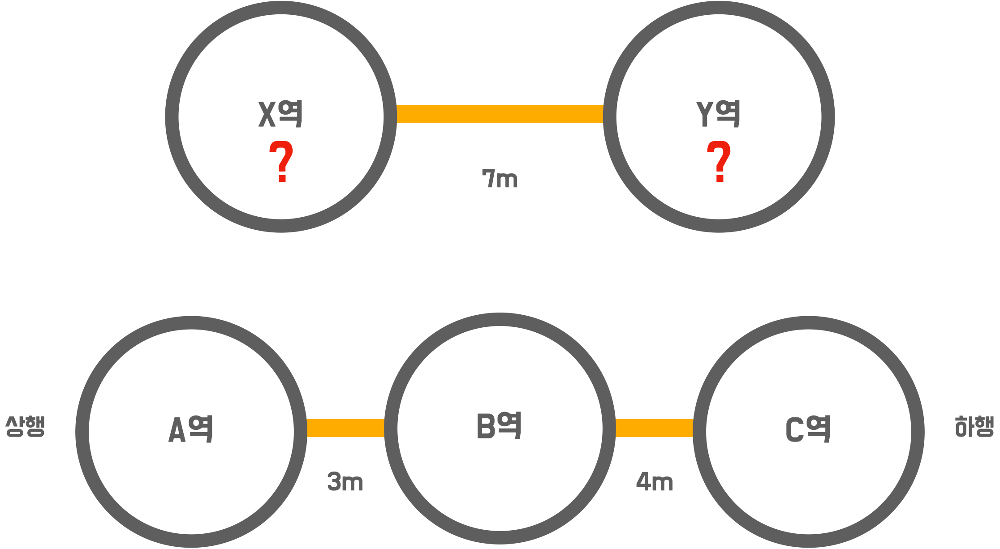
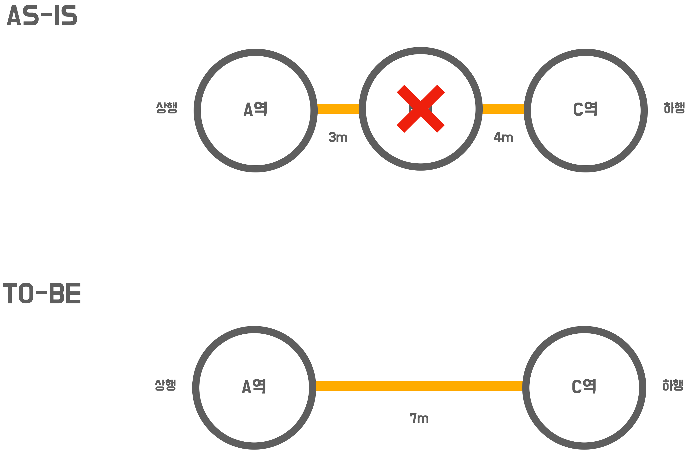

<p align="center">
    
</p>
<p align="center">
  
  
  <a href="https://edu.nextstep.camp/c/R89PYi5H" alt="nextstep atdd">
    
  </a>
  
</p>

<br>

# 지하철 노선도 미션
[ATDD 강의](https://edu.nextstep.camp/c/R89PYi5H) 실습을 위한 지하철 노선도 애플리케이션

<br>

## 🚀 Getting Started

### Install
#### npm 설치
```
cd frontend
npm install
```
> `frontend` 디렉토리에서 수행해야 합니다.

### Usage
#### webpack server 구동
```
npm run dev
```
#### application 구동
```
./gradlew bootRun
```
<br>

## ✏️ Code Review Process
[텍스트와 이미지로 살펴보는 온라인 코드 리뷰 과정](https://github.com/next-step/nextstep-docs/tree/master/codereview)

<br>

## 🐞 Bug Report

버그를 발견한다면, [Issues](https://github.com/next-step/atdd-subway-admin/issues) 에 등록해주세요 :)

<br>

## 📝 License

This project is [MIT](https://github.com/next-step/atdd-subway-admin/blob/master/LICENSE.md) licensed.

## 1단계 - 지하철역 인수 테스트 작성
* 기능 요구사항
  * 지하철역 인수 테스트를 완성하세요.
    * 지하철역 목록 조회 인수 테스트 작성하기
    * 지하철역 삭제 인수 테스트 작성하기


* [x] 기능구현
  * [x] 지하철역 목록 조회 인수 테스트
  * [x] 지하철역 삭제 인수 테스트
  * [x] 중복 테스트 코드 리팩토링


## 2단계 - 지하철 노선 기능
* 기능 요구사항
  * 요구사항 설명에서 제공되는 인수 조건을 기반으로 지하철 노선 관리 기능을 구현하세요.
  * 인수 조건을 검증하는 인수 테스트를 작성하세요.


* 프로그래밍 요구사항
  * 아래의 순서로 기능을 구현하세요.
    * 인수 조건을 검증하는 인수 테스트 작성
    * 인수 테스트를 충족하는 기능 구현
  * 인수 테스트의 결과가 다른 인수 테스트에 영향을 끼치지 않도록 인수 테스트를 서로 격리 시키세요.
  * 인수 테스트의 재사용성과 가독성, 그리고 빠른 테스트 의도 파악을 위해 인수 테스트를 리팩터링 하세요.

* 요구사항 설명
  * 인수 조건
    * 지하철노선 생성
    ```
    When 지하철 노선을 생성하면
    Then 지하철 노선 목록 조회 시 생성한 노선을 찾을 수 있다
    ```
    * 지하철노선 목록 조회
    ```
    Given 2개의 지하철 노선을 생성하고
    When 지하철 노선 목록을 조회하면
    Then 지하철 노선 목록 조회 시 2개의 노선을 조회할 수 있다.
    ```
    * 지하철노선 조회
    ```
    Given 지하철 노선을 생성하고
    When 생성한 지하철 노선을 조회하면
    Then 생성한 지하철 노선의 정보를 응답받을 수 있다.
    ```
    * 지하철노선 수정
     ```
    Given 지하철 노선을 생성하고
    When 생성한 지하철 노선을 수정하면
    Then 해당 지하철 노선 정보는 수정된다
     ```
    * 지하철노선 삭제
    ```
    Given 지하철 노선을 생성하고
    When 생성한 지하철 노선을 삭제하면
    Then 해당 지하철 노선 정보는 삭제된다
    ```
  

* [x] 구현목록
  * [x] 요구사항 설명 목록
  * [x] @sql 애너테이션 사용
    * [x] truncate.sql, data.sql
  * [x] find, delete 시 데이터가 없으면 예외발생 및 404 에러 반환

* 리뷰 피드백(리뷰어: 김석홍 님)
  * 필드 컬럼 설정, 변수명, 의미없는 오버라이드 삭제, 미사용 테스트 클래스 삭제, spring 어노테이션 사용 등
  * Request 필드를 따로 받도록
  * repository.find 시 null 리턴 대신 예외가 발생하도록
  * 특정 상황에서 dto 내부 메소드로 새로운 객체 생성 방법 부적절

## 3단계 - 구간 추가 기능
### 요구사항
  #### 기능 요구사항
  * 요구사항 설명에서 제공되는 요구사항을 기반으로 지하철 구간 추가 기능을 구현하세요.
  * 요구사항을 정의한 인수 조건을 조출하세요.
  * 인수 조건을 검증하는 인수 테스트를 작성하세요.
  * 예외 케이스에 대한 검증도 포함하세요.
  
  #### 프로그래밍 요구사항
  * 인수 테스트 주도 개발 프로세스에 맞춰서 기능을 구현하세요.
  * 요구사항 설명을 참고하여 인수 조건을 정의
  * 인수 조건을 검증하는 인수 테스트 작성
  * 인수 테스트를 충족하는 기능 구현
  * 인수 조건은 인수 테스트 메서드 상단에 주석으로 작성하세요.
  * 뼈대 코드의 인수 테스트를 참고
  * 인수 테스트의 결과가 다른 인수 테스트에 영향을 끼치지 않도록 인수 테스트를 서로 격리 시키세요.
  * 인수 테스트의 재사용성과 가독성, 그리고 빠른 테스트 의도 파악을 위해 인수 테스트를 리팩터링 하세요.


### 요구사항 설명
  #### API 명세
* 구간 등록 API request
  ```
  POST /lines/1/sections HTTP/1.1
  accept: */*
  content-type: application/json; charset=UTF-8
  host: localhost:52165
  
  {
  "downStationId": "4",
  "upStationId": "2",
  "distance": 10
  }
  ```
  
#### 지하철 구간 등록 인수 테스트 작성과 기능 구현
* 역 사이에 새로운 역을 등록할 경우
  * 새로운 길이를 뺀 나머지를 새롭게 추가된 역과의 길이로 설정
  > 
  * 새로운 역을 상행 종점으로 등록할 경우
  > 
  * 새로운 역을 하행 종점으로 등록할 경우
  >  
* 구간 등록 시 예외 케이스를 고려하기
  * 역 사이에 새로운 역을 등록할 경우 기존 역 사이 길이보다 크거나 같으면 등록을 할 수 없음
  > 
  * 상행역과 하행역이 이미 노선에 모두 등록되어 있다면 추가할 수 없음
    * 아래의 이미지 에서 A-B, B-C 구간이 등록된 상황에서 B-C 구간을 등록할 수 없음(A-C 구간도 등록할 수 없음)
  > 
  * 상행역과 하행역 둘 중 하나도 포함되어있지 않으면 추가할 수 없음
  > 

#### 구현목록
* Domain
  * Section.java (Entity)
    * 구간 Entity
    * 구간정보 업데이트
      * 구간 거리 업데이트 계산 로직 제거 (인수 거리 값을 그대로 넣도록 변경)
  * Sections.java (Embeddable)
    * 구간 리스트를 가진 일급 컬렉션 
    * 구간 정보를 추가하고 유효성 체크
  * Line.java
    * 상행 하행만 있던 필드를 제거하고 Sections 필드 추가
* Controller
  * LineController.java
    * 구간 추가 및 조회 메서드 추가 
* Service
  * LineService.java
    * 구간 추가 및 조회 메서드 추가

#### [코드리뷰 피드백](https://github.com/next-step/atdd-subway-admin/pull/739) (리뷰어: 김석홍 님)

## [4단계 - 구간 제거 기능](https://edu.nextstep.camp/s/X02BsEA0/ls/57pXXJOr)
### 요구사항
#### 기능 요구사항 
* 요구사항 설명에서 제공되는 요구사항을 기반으로 지하철 구간 제거 기능을 구현하세요.
* 외 3단계와 동일

#### 프로그래밍 요구사항
* 인수 테스트 주도 개발 프로세스에 맞춰서 기능을 구현하세요.
  * 요구사항 설명을 참고하여 인수 조건을 정의
  * 인수 조건을 검증하는 인수 테스트 작성
  * 인수 테스트를 충족하는 기능 구현
* 인수 조건은 인수 테스트 메서드 상단에 주석으로 작성하세요.
  * 뼈대 코드의 인수 테스트를 참고
* 인수 테스트의 결과가 다른 인수 테스트에 영향을 끼치지 않도록 인수 테스트를 서로 격리 시키세요.
* 인수 테스트의 재사용성과 가독성, 그리고 빠른 테스트 의도 파악을 위해 인수 테스트를 리팩터링 하세요.

### 요구사항 설명
#### API 명세
* 지하철 구간 삭제 request
  ```
  DELETE /lines/1/sections?stationId=2 HTTP/1.1
  accept: */*
  host: localhost:52165
  ```
* 노선의 구간을 제거하는 기능을 구현하기
  * 종점이 제거될 경우 다음으로 오던 역이 종점이 됨
  * 중간역이 제거될 경우 재배치를 함
    * 노선에 A - B - C 역이 연결되어 있을 때 B역을 제거할 경우 A - C로 재배치 됨
    *  거리는 두 구간의 거리의 합으로 정함
    

* 구간 삭제 시 예외 케이스를 고려하기
  * 기능 설명을 참고하여 예외가 발생할 수 있는 경우를 검증할 수 있는 인수 테스트를 만들고 이를 성공 시키세요.
    > 예시) 노선에 등록되어있지 않은 역을 제거하려 한다.

* 구간이 하나인 노선에서 마지막 구간을 제거할 때
  * 제거할 수 없음
  

### 구현목록
* 지하철 구간 삭제
  * 이전 역의 구간거리는 삭제한 역간 구간 거리만큼 추가
    * Domain
      * Sections.java
        * delete()
          * 역 삭제
          * 구간 거리 업데이트
          * 이전, 다음 구간 역 재연결
  * 테스트
    * Sections 및 인수 테스트 작성
